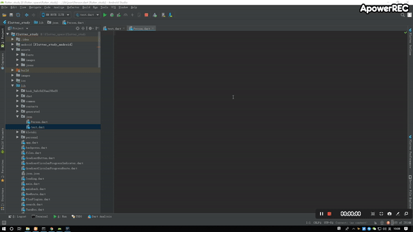

# dart_to_json_bean


一个可由json 生成 dart bean 的工具包;

仅适用于 `AndroidStudio` 

## 演示效果



## 准备工作

### 1. IDE添加插件 

安装配套的`jetbrains`插件:[JsonToDartBean](https://plugins.jetbrains.com/plugin/12483-jsontodartbean)

针对`Windows`

```
File ->  setting -> plugins -> browse plugins -> 'search JsonToDartBean' -> 'install'
```

针对`mac` 

```
prefrence -> plugins -> browse plugins -> 'search JsonToDartBean' -> 'install'
```

针对 `linux` 类似.


### 2. 添加 package 依赖

进入 flutter 项目目录,打开 `pubspec.yaml` 文件,添加如下依赖:

```yaml
dependencies:
  # ...
  json_holder_impl: ^1.0.0
  # ...

```

在项目根目录 执行命令:

```
flutter packages get
```

## 使用步骤

在依照上面流程准备完毕后,可以以以下步骤使用

### 1. 新建 bean 文件

`dart-bean`文件即一般的dart 类(例如`Person.dart`),新建后文件内容应当为空

### 2. 使用 JsonToDartBean 插件

`JsonToDartBean`插件默认快捷键为:`alt d`;

可在工具栏: `code -> JsonToDartBean` 查看

如果想修改,可以: keymap -> 'search JsonToDartBean' -> 'change'

> **注意**: `JsonToDartBean` 只能在 `*.dart` 文件中使用.

该插件基于[GsonFormat](https://github.com/zzz40500/GsonFormat),因此使用步骤类似:

 1. 在新建的文件 `Person.dart` 内,使用快捷键 或者 通过 `code ->  JsonToDartBean` 弹出编辑窗口;主类名会自动填入,当然可以自行修改.
 2. 将 json 格式文本粘贴到中间编辑框中,可以点击右上按钮`format`按钮查看json格式是否正确,如无问题请点击`OK` 按钮.
 3. 此时会弹出显示字段以及类型的预览,其中类型值可手动进行修改(但务必保证类型与真实数据类型相同),比如可以将 `int` 类型转换为 `num` 类型;若无问题,点击 `OK` 按钮.
 4. 在格式无误,且数据正确的情况下,会弹出 `result` 窗口,直接将生成内容拷贝粘贴到 `Person.dart` 文件中即可(生成result-dialog时,ide下方已经弹出了提示,此时内容其实已经在系统clipboard中,使用时不需要再进行 ctrl + a ,ctrl + c,直接到 `Person.dart`文件或其他目标文件 中按下 ctrl + v 即可).

### 3. 类创建及成员调用

例如上面的 Person 类,我们在使用时,需要通过 `fromJson` 命名构造函数来进行创建:

```dart
var bean = Person.fromJson(json);
```

Person.fromJson 的参数可以传入 null,表示创建一个成员皆为 null 的 实例;

事实上,自动生成的代码中,也只有 这一个构造函数,如果想添加额外的构造函数,需要将 `Person.fromJson` 构造函数中的代码拷贝到额外自定义的构造函数中.

## 高级功能

### 1. 缓存模式:开启/关闭

这个功能一般用不到;

在刚生成bean 没有进行成员调用或其他操作时,调用 toString() 方法,可以得到我们创建时传入的 json 数据(一般而言,该json 为 `Map<String,dynamic>` 类型)

之后调用成员时,库内逻辑会自动缓存,保证之后调用相同成员的速度(第一次 调用成员时,可能面临类型强转的问题);

默认缓存模式处于开启状态,如果不想擦除原 json 数据内容,可以将其关闭:

```dart
JsonHolderImpl.isCacheMode = false;
```

注:*当前该功能未开放,若有此方面需求,再升级版本*

### 2. 自定义数据强转

该库功能模仿 java 中的 Gson 库,但由于  dart 不支持 `反射  reflect` 或者 `镜像 mirror` 操作 ,因此无法通过黑科技来完成数据转换的功能.

库中默认了一套默认数据强转的规则,逻辑在:

```
JsonHolderImpl.conventsMap
```

现在假如要默认一个int类型数据强转为 String 数据时,变成 hex 码,可以这样处理:

```dart
JsonHolderImpl.conventsMap["int=>String"] = (value) {
  return (value as int).toRadixString(16);
};
```

同样的,针对json中的null值,也可以如此处理:

```dart
JsonHolderImpl.conventsMap["Null=>int"] = (value) {
  return 0;
},
```

## 其他

### 1. 内部类?

dart 中 class 内部 不能嵌套 class,这点和java等其他语言有很大的不同,因此,生成的bean如果有内部类的话,会被置于跟 main class 同一级.

class 嵌套 class 会提示如下信息:

```
Classes can't be declared inside other classes
```

### 2. 卡顿?

该库使用时,在创建 bean 时不会有任何卡顿,但是在第一次调用成员属性时,会做较多的逻辑操作;
不过整体来说,因为没有跨进程操作,也没有太多的循环处理,就目前阶段,如果不是对性能有特别高的要求,这个库足以应付.

### 3. dart泛型与java泛型

java中的泛型,是在 1.5 引入新特性,虚拟机层面并没有对泛型做运行时判断,因此说java 泛型是擦除的.

kotlin 由于也是 jvm 语言,几乎所有的kotlin 代码 都可以等同于一段 java 代码,因此,即便kotlin 泛型好像可以一直存在,但在运行时,仍然不会做判断.

dart 则不同,dart 中泛型在运行时存在,即: List<int> 类型 和 List<double> 类型是不一样的,即便list中存储的内容都是 int 类型,仍然无法相互赋值.

更麻烦的是,针对这个方法:

```dart
F getValue<F>(String key) {
  List<int> b = <int>[];
  print(b.runtimeType == F); // false
  // ...
}
```

即便 F 在方法调用时,对应的Type 为 List<int> 类型,但其与 b 的类型还是不同,也就是说,针对泛型无法直接通过 `==` 判断 Type;(当然,b.runtimeType.toString() == F.toString() 为 true).

库中使用了比较笨的方法,通过列举和子类实现来完成复杂的创建逻辑.具体可参考源码[json_holder_impl](./lib/json_holder_impl.dart) 

### 4. List<List<List<...>>>?

针对这种嵌套List的情况,插件`JsonToDartBean` 可以正常解析,但本库最多支持两层嵌套,即List<List<int>> 可以无感知调用,其他更深层的嵌套目前暂不支持(一般两层足够了,如果涉及到三层或者更多层次,就需要考虑数据结构设计是否合理)

### 5. json or jsonStr

用于构造等的 json 对象为 map类型,同样,toJson 方法也会返回 map类型数据,如果需要可用于网络数据交换的json字符串格式,需要自行使用 convert 库转换:

```dart
/// toJson 生成的字符串,并非是 json 格式,如果需要json 格式字符串,需要调用 [dart:convert] 包中 json.encode(obj)
@override
String toString() {
  return _innerMap.toString();
}
```

---

---

*`JsonToDartBean`插件源码来源参照[GsonFormat](https://github.com/zzz40500/GsonFormat),若有版本问题,请及时告知*